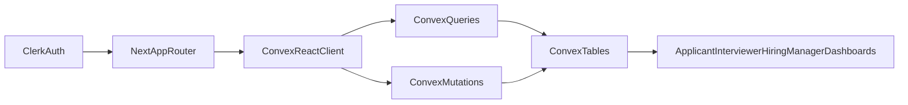

# Convex ATS Migration + Role Signup Plan

## Outcomes
- Move ATS persistence from Mongo route handlers to Convex real-time queries/mutations.
- Add role-aware onboarding tied to Clerk users (`applicant`, `interviewer`, `hiring_manager`).
- Preserve your existing ATS page structure and gamified UI while switching the data source.
- Keep seed data for dev/demo while supporting real user-generated records in Convex.

## Current State Anchors
- Auth and route protection are in [`/Users/brandi/Desktop/Computer/campfire/src/proxy.ts`](/Users/brandi/Desktop/Computer/campfire/src/proxy.ts) and root provider in [`/Users/brandi/Desktop/Computer/campfire/src/app/layout.js`](/Users/brandi/Desktop/Computer/campfire/src/app/layout.js).
- ATS state currently loads through Next API + Mongo from [`/Users/brandi/Desktop/Computer/campfire/src/context/AtsContext.tsx`](/Users/brandi/Desktop/Computer/campfire/src/context/AtsContext.tsx) and [`/Users/brandi/Desktop/Computer/campfire/src/lib/ats/mongo.ts`](/Users/brandi/Desktop/Computer/campfire/src/lib/ats/mongo.ts).
- Domain types/seed data are centralized in [`/Users/brandi/Desktop/Computer/campfire/src/data/ats/mockData.ts`](/Users/brandi/Desktop/Computer/campfire/src/data/ats/mockData.ts).
- Signup/signin are basic Clerk screens in [`/Users/brandi/Desktop/Computer/campfire/src/app/sign-up/[[...sign-up]]/page.js`](/Users/brandi/Desktop/Computer/campfire/src/app/sign-up/[[...sign-up]]/page.js) and [`/Users/brandi/Desktop/Computer/campfire/src/app/sign-in/[[...sign-in]]/page.js`](/Users/brandi/Desktop/Computer/campfire/src/app/sign-in/[[...sign-in]]/page.js).

## Target Architecture

## Data Model (Convex)
- Add Convex schema in `convex/schema.ts` with these tables:
  - `users`: `clerkUserId`, `role`, `email`, `firstName`, `lastName`, `avatar`, `onboardingCompleted`, `xpSummary`.
  - `companies`: from existing company seed model.
  - `jobs`: core job posting fields, stage config, assigned hiring team IDs.
  - `applications`: one per applicant+job, stage state and timeline dates, source, public feedback.
  - `tasks`: gamified quests/challenges (general/company/role), points and metadata.
  - `taskCompletions`: append-only completion events per user/application.
  - `scorecards`: interviewer structured feedback and recommendation.
  - `gamificationEvents`: immutable XP/badge/stage events for audit and replay.
- Indexes:
  - `users.byClerkUserId`, `users.byRole`
  - `jobs.byCompanyId`, `jobs.byStatus`, `jobs.byHiringManagerId`
  - `applications.byApplicantUserId`, `applications.byJobId`, `applications.byStage`
  - `scorecards.byApplicationId`, `scorecards.byInterviewerUserId`
  - `taskCompletions.byUserId`, `taskCompletions.byApplicationId`
  - `gamificationEvents.byUserId`, `gamificationEvents.byType`

## Auth + Role Enforcement Pattern
- Role source of truth:
  - Clerk `publicMetadata.role` at signup.
  - Mirror into Convex `users.role` on first sync/upsert.
- Add role-aware onboarding flow:
  - Replace current generic sign-up screen with a role selection step and then Clerk sign-up.
  - On first authenticated load, call Convex mutation to create/sync user profile from Clerk and selected role.
- Protect routes by role in middleware:
  - `applicant/*` -> applicant only
  - `interviewer/*` -> interviewer only
  - `recruiter/*` replaced or aliased to `hiring_manager/*` logic (or keep URL but enforce role mapping).
- Enforce role checks in Convex functions (not just middleware), so data access remains safe even if route logic changes.

## Migration Strategy (Low-Risk)
1. Introduce Convex in parallel (provider + schema + seed + core functions).
2. Keep existing pages/components but update `AtsContext` to consume Convex query/mutation hooks instead of Next API endpoints.
3. Leave old `/api/ats/*` routes as temporary compatibility layer during migration.
4. Once dashboards run fully from Convex, remove Mongo helper usage and deprecate Mongo seed script.

## Seed + Real Data Strategy
- Keep deterministic seed data based on existing `mockData` model for local bootstrap.
- Add Convex seed mutation/script that:
  - inserts companies, tasks, jobs, and optional demo users if tables are empty.
  - is idempotent (safe to rerun).
- Real user behavior:
  - New Clerk user signs up with role.
  - User is auto-created in Convex `users` and gets role-specific starter state.
  - Applicant actions (apply/complete tasks), interviewer feedback, hiring manager job edits write directly to Convex.

## File-Level Implementation Plan
- Add Convex infra:
  - `convex/schema.ts`
  - `convex/users.ts`, `convex/jobs.ts`, `convex/applications.ts`, `convex/scorecards.ts`, `convex/tasks.ts`, `convex/gamification.ts`, `convex/seed.ts`
  - `src/lib/convex/client.ts` and provider wiring in [`/Users/brandi/Desktop/Computer/campfire/src/app/layout.js`](/Users/brandi/Desktop/Computer/campfire/src/app/layout.js)
- Role onboarding:
  - update [`/Users/brandi/Desktop/Computer/campfire/src/app/sign-up/[[...sign-up]]/page.js`](/Users/brandi/Desktop/Computer/campfire/src/app/sign-up/[[...sign-up]]/page.js)
  - add role selection/onboarding helper component under `src/components/ats/auth/`
- Route protection + role checks:
  - update [`/Users/brandi/Desktop/Computer/campfire/src/proxy.ts`](/Users/brandi/Desktop/Computer/campfire/src/proxy.ts)
- State layer migration:
  - refactor [`/Users/brandi/Desktop/Computer/campfire/src/context/AtsContext.tsx`](/Users/brandi/Desktop/Computer/campfire/src/context/AtsContext.tsx) from fetch-based API calls to Convex hooks.
- Seed source reuse:
  - adapt [`/Users/brandi/Desktop/Computer/campfire/src/data/ats/mockData.ts`](/Users/brandi/Desktop/Computer/campfire/src/data/ats/mockData.ts) into Convex seed input.
- Transitional cleanup:
  - mark [`/Users/brandi/Desktop/Computer/campfire/src/lib/ats/mongo.ts`](/Users/brandi/Desktop/Computer/campfire/src/lib/ats/mongo.ts), [`/Users/brandi/Desktop/Computer/campfire/scripts/seed-mongodb.mjs`](/Users/brandi/Desktop/Computer/campfire/scripts/seed-mongodb.mjs), and `/src/app/api/ats/**` for removal after parity verification.

## Verification Plan
- Auth/role:
  - sign up three users with each role and verify role-locked route access.
- Data writes:
  - applicant applies to job and completes tasks -> XP and progress update in real time.
  - interviewer submits scorecard -> applicant/hiring manager views update.
  - hiring manager creates/edits jobs -> listings update live.
- Seed:
  - run seed twice and verify no duplicates.
- Regression:
  - existing applicant/recruiter/interviewer pages render with Convex-backed data and no API regression.

## Risks to Watch
- Existing UI names `recruiter` while requested business role is `hiring_manager`; decide whether to keep URL naming for backward compatibility.
- Clerk metadata update timing can lag right after signup; onboarding should handle eventual consistency.
- Large nested seed objects from `mockData` may need normalization in Convex for performant subscriptions.
