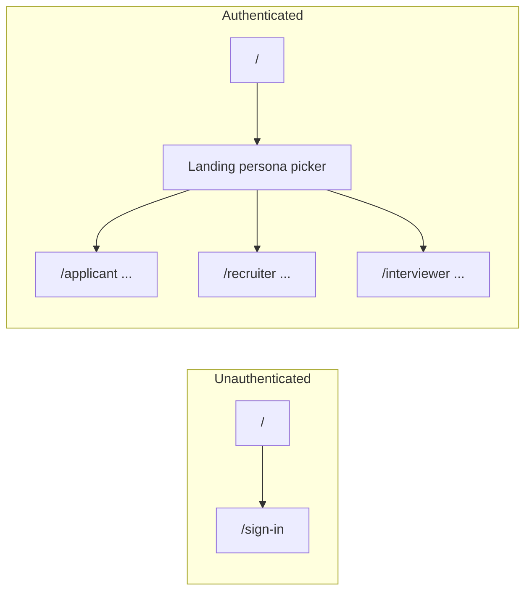

# Integrate Gamified ATS into Campfire (Next.js)

## What you have today

| Layer     | Root app                                                                                            | Gamified folder                                                                                                                                          |
| --------- | --------------------------------------------------------------------------------------------------- | -------------------------------------------------------------------------------------------------------------------------------------------------------- |
| Framework | Next 16 App Router (`[src/app/layout.js](src/app/layout.js)`, `[src/app/page.js](src/app/page.js)`) | Vite SPA (`[Gamified ATS Dashboard/vite.config.ts](Gamified ATS Dashboard/vite.config.ts)`)                                                              |
| Routing   | File-based; `/` redirects unauthenticated users to sign-in and authenticated users to `/home`       | `[react-router](Gamified ATS Dashboard/src/app/routes.tsx)` with paths `/`, `/applicant`, `/recruiter`, `/interviewer`, …                                |
| State     | None for app domain                                                                                 | Client `[AppContext](Gamified ATS Dashboard/src/app/context/AppContext.tsx)` + `[mockData.ts](Gamified ATS Dashboard/src/app/data/mockData.ts)`          |
| Styling   | Tailwind v4 in `[src/app/globals.css](src/app/globals.css)`                                         | Tailwind v4 + `[theme.css](Gamified ATS Dashboard/src/styles/theme.css)` / `[fonts.css](Gamified ATS Dashboard/src/styles/fonts.css)` + `tw-animate-css` |

Your choice (**replace `/home`**, persona routes at **root paths**) implies:

- Authenticated users should land in the ATS world (QuestHire landing + `/applicant` | `/recruiter` | `/interviewer`), not the current Campfire welcome page.
- `[src/app/home/page.js](src/app/home/page.js)` should become a **redirect** to `/` (or be removed) so bookmarks still work.

---

## Recommended architecture

### 1. Replace React Router with the App Router (non-negotiable for “seamless” Next integration)

- **Delete** the SPA entry pattern: `[main.tsx](Gamified ATS Dashboard/src/main.tsx)`, `[App.tsx](Gamified ATS Dashboard/src/app/App.tsx)`, `[routes.tsx](Gamified ATS Dashboard/src/app/routes.tsx)` (`createBrowserRouter` / `RouterProvider`).
- **Map each old route to a `page` file** under `[src/app/](src/app/)`, mirroring existing paths:

| Old path                                               | New Next segment                                                                           |
| ------------------------------------------------------ | ------------------------------------------------------------------------------------------ |
| `/`                                                    | `[src/app/page.js](src/app/page.js)` (already exists — behavior changes; see below)        |
| `/applicant`, `/applicant/tasks`, `/applicant/profile` | `src/app/applicant/page.jsx`, `tasks/page.jsx`, `profile/page.jsx`                         |
| `/recruiter`, `/recruiter/jobs`, …                     | `src/app/recruiter/...`                                                                    |
| `/interviewer`, `/interviewer/candidate/...`           | `src/app/interviewer/...` (dynamic segments `[applicantId]` / `[jobId]` for the scorecard) |

- **Refactor imports** in moved files: `Link`, `useNavigate`, `useLocation`, `useParams` from `react-router` → `next/link`, `useRouter`, `usePathname`, `useParams` from `next/navigation`.

### 2. Client boundaries: `AppProvider` + optional shared shell layout

- `[AppProvider](Gamified ATS Dashboard/src/app/context/AppContext.tsx)` must run on the client. Add a small client wrapper (e.g. `src/components/ats/AtsProviders.jsx`) that renders `AppProvider` and is imported from a **layout** that wraps only ATS routes.
- **Layout strategy (pick one and apply consistently):**
  - **Option A (simplest):** One client `layout.jsx` under a [route group](https://nextjs.org/docs/app/building-your-application/routing/route-groups) e.g. `src/app/(ats)/layout.jsx` that wraps `(ats)/applicant`, `(ats)/recruiter`, `(ats)/interviewer` **and** supplies the shell where needed. The Landing page at `/` can sit inside or outside the group depending on whether you want `AppProvider` for the whole tree under `/` for signed-in users only.
  - **Option B:** Keep `[AppShell](Gamified ATS Dashboard/src/app/components/layout/AppShell.tsx)` as a client component imported by each segment layout or by individual pages (more duplication, less magic).

Recommendation: **route group `(ats)`** with a client layout that provides `AppProvider`; nest **shell-only** layouts for `/applicant`, `/recruiter`, `/interviewer` (matching current `WithShell` in routes).

### 3. Root page behavior (`[src/app/page.js](src/app/page.js)`)

Today: unauthenticated → `/sign-in`; authenticated → `/home`.

Target:

- **Unauthenticated:** keep redirect to `/sign-in` (or show marketing + CTA — only if you explicitly want a public landing later).
- **Authenticated:** render the QuestHire **Landing** (persona picker) as a **client component** (the Figma landing uses hooks), not a server-only page.

Implementation pattern: thin server `page.js` that calls `auth()`; if `userId`, render `<AtsLanding />` (client); else `redirect('/sign-in')`.

### 4. `/home` deprecation

- Replace `[src/app/home/page.js](src/app/home/page.js)` with `redirect('/')` **or** delete the folder and add a redirect in `next.config.mjs` from `/home` → `/`.

### 5. TypeScript vs JavaScript

The dashboard is `**.tsx`**. The repo uses `**jsconfig\*\` only. For a maintainable merge:

- Add `**tsconfig.json`** (Next + `"paths": { "@/*": ["./src/*"] }"`) and `**allowJs`: true so existing `.js`pages keep working while new/moved ATS code stays`.tsx`.

### 6. Dependencies

Merge `[Gamified ATS Dashboard/package.json](Gamified ATS Dashboard/package.json)` into the root `[package.json](package.json)`: Radix UI packages, `lucide-react`, `motion`, `recharts`, `react-hook-form`, `react-dnd`, `cmdk`, `vaul`, `sonner`, `date-fns`, `canvas-confetti`, `class-variance-authority`, `clsx`, `tailwind-merge`, `next-themes`, `react-day-picker`, `embla-carousel-react`, `input-otp`, `react-resizable-panels`, etc. **Omit** `@mui/`_ and `@emotion/`_ if unused (confirmed: **no imports** in the Gamified tree).

Remove `**react-router` after migration (Next handles routing).

Run install and fix any **React 19** peer warnings (the Gamified package lists React 18 peers; Next uses React 19 — usually fine, verify with a full `next build`).

### 7. Styles and Tailwind v4

- Fold Gamified imports from `[index.css](Gamified ATS Dashboard/src/styles/index.css)` into root styling:
  - Import `**theme.css`** and `**fonts.css\*\`from the merged location (e.g.`src/styles/ats/`).
  - Ensure Tailwind **scans** new files: extend the `@source` pattern in `[globals.css](src/app/globals.css)` (or a dedicated imported sheet) so classes in moved components are generated — mirror the Gamified `[tailwind.css](Gamified ATS Dashboard/src/styles/tailwind.css)` approach (`@source` for `src/**/*.{js,ts,jsx,tsx}`).
- Import `**tw-animate-css` in the same chain as the Gamified app (add dependency).
- Resolve **font duplication**: root uses Geist via `next/font`; Gamified may add Inter/other in `fonts.css` — either scope ATS fonts to the ATS layout or align on one stack for visual consistency.

### 8. Clerk integration

- **Protect ATS routes:** use `[clerkMiddleware](https://clerk.com/docs/references/nextjs/clerk-middleware)` (add `[middleware.js](middleware.js)` at project root if missing) with `createRouteMatcher` for `/applicant(.*)`, `/recruiter(.*)`, `/interviewer(.*)`, and authenticated `/`.
- **Optional (phase 2):** map Clerk `userId` / `publicMetadata.role` to default persona instead of only the demo picker; keep `AppContext` `persona` for UI until MongoDB owns roles.

### 9. MongoDB integration (phased)

**Phase 1 (seamless UI):** keep `**mockData`** and `**AppContext\*\` as-is so the app runs end-to-end.

**Phase 2:** introduce API routes under `src/app/api/ats/...` using `[getDb](src/lib/mongodb)` (same pattern as `[src/app/api/mongodb/example/route.js](src/app/api/mongodb/example/route.js)`):

- Collections aligned with types in `[mockData.ts](Gamified ATS Dashboard/src/app/data/mockData.ts)`: e.g. `jobs`, `applicants`, `applications`, `scorecards`, `companies`.
- Replace context mutations with `fetch` + optimistic updates, or **Server Actions** + `revalidatePath`, depending on preference.

---

## File / folder layout (target)

- Move dashboard source out of the nested folder into the app tree, then **remove** `[Gamified ATS Dashboard/](Gamified ATS Dashboard/)` (or keep as reference until the cutover is verified):
  - `src/components/ats/ui/` (shadcn-style components)
  - `src/components/ats/layout/AppShell.tsx`
  - `src/context/AtsContext.tsx` (rename from `AppContext` if you want clarity)
  - `src/data/ats/mockData.ts`
  - `src/app/(ats)/...` — page files per route above

---

## Verification checklist

- `next dev` / `next build` with no missing module errors.
- All internal links use `**next/link` and match file routes.
- Clerk: unauthenticated users cannot open `/applicant`, `/recruiter`, `/interviewer`.
- `/home` redirects to `/` for signed-in users.

---

## Risk notes

- **Two routers:** Do not nest `RouterProvider` inside Next — full migration to file-based routes is required.
- **Server vs client:** Any file using `useState`, `useApp`, or browser APIs must be a client component (`'use client'`).
- **Dynamic route params:** `useParams()` in Next returns string values; align with `[RecruiterKanban](Gamified ATS Dashboard/src/app/pages/recruiter/RecruiterKanban.tsx)` / scorecard expectations.
